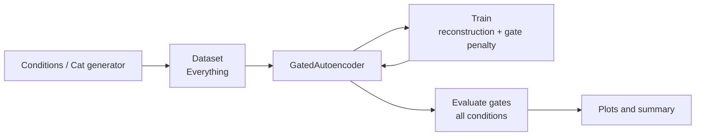

# Architecture: Compositional Dynamic Depth

This document describes the pipeline, data model, and neural architecture used to test the prediction that **effective depth** (how many layers contribute) should track **compositional complexity** of the input.

## Goal

Standard deep networks apply every layer to every input. Here we argue that depth should be **dynamic and input-dependent**: simpler inputs (e.g. static scene) need fewer layers; more complex inputs (articulated body, varying appearance, background) need more. Each layer has a learnable **gate** α_ℓ ∈ [0,1]. The **effective depth** is D_eff = Σ α_ℓ. The compositional symmetry framework (Ruffini 2025) predicts that layers aligned with inactive symmetry scales should have near-zero gates.

## Data: 7-level cat hierarchy

The synthetic data is a **2D articulated cat** with a fully controlled Lie-group hierarchy. Each level corresponds to a subgroup of the generative parameters:

| Level | Group / parameters | Description |
|-------|--------------------|-------------|
| 1 | Camera SE(2) × R⁺ | Rotation, translation, scale |
| 2 | Root body SE(2) | Body position and orientation |
| 3 | Spine SO(2)³ | 3 spine joints |
| 4 | Limbs SO(2)⁸ | 2 joints × 4 legs |
| 5 | Head & tail SO(2)⁴ | Head pan/tilt, 2 tail joints |
| 6 | Appearance R⁶ | Colour, thickness, stripes, etc. |
| 7 | Background R³ | Gradient, colour, intensity |

A **condition** is a subset of levels (e.g. "FullPose" = levels 1–4, "Everything" = all 7). The data generator and condition definitions live in [scripts/compositional_cat.py](scripts/compositional_cat.py).

## Model: Gated autoencoder

The network is a **symmetry-gated autoencoder**: encoder → latent vector → decoder. Each residual block in the encoder (and optionally decoder) is **gated**:

- **Update rule:** h_{ℓ+1} = h_ℓ + α_ℓ(x, h_ℓ) · Δ_ℓ(h_ℓ)
- α_ℓ is a scalar in [0,1] computed from the pooled hidden state (one per layer).
- Training uses a **gate penalty** λ Σ α_ℓ to encourage sparsity.

The encoder has several **stages**; each stage has multiple **blocks**. Total gated layers = `n_stages` × `n_blocks`. Implementation: [scripts/gated_resnet.py](scripts/gated_resnet.py).

## Pipeline

End-to-end flow:

1. **Data:** Build an on-the-fly dataset for the "Everything" condition (all 7 levels active).
2. **Train:** Train the gated autoencoder on reconstruction; gate penalty encourages low α where possible.
3. **Evaluate:** For each condition (Static, CameraOnly, …, Everything), run the model and record per-layer gate means and reconstruction error.
4. **Predictions:** Compare gate patterns and D_eff across conditions to test four predictions (see below).
5. **Plots and summary:** Write `dynamic_depth_results.png` and per-run manifests.

Pipeline implementation: [scripts/train_and_evaluate.py](scripts/train_and_evaluate.py).

## Four predictions

The technical note tests four predictions:

1. **Gate–complexity alignment:** Heatmap of mean gate α per condition × layer should show a "staircase" (more active levels → more layers engaged).
2. **Depth–complexity curve:** D_eff (effective depth) should increase monotonically with the number of active generative levels.
3. **Per-layer gate profiles:** Simple conditions should have gates near zero at deeper layers; complex conditions use more layers.
4. **Reconstruction error:** More complex conditions are harder to reconstruct (higher MSE).

Outputs: `gate_analysis.json`, `training_history.json`, and `dynamic_depth_results.png` (four panels) in each run’s `output_dir`. Job metadata is written to `jobs/jobs_registry.json` and to `output_dir/job_manifest.json` for reproducibility.
